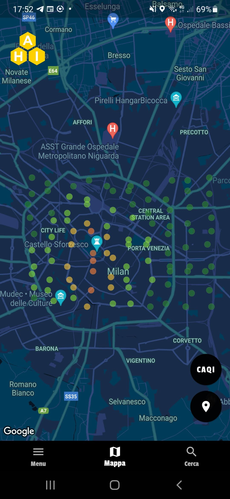
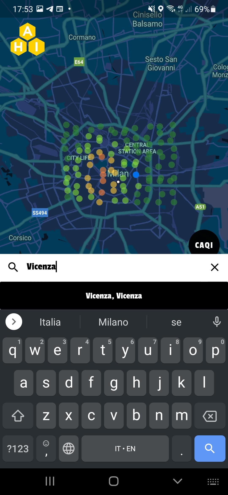
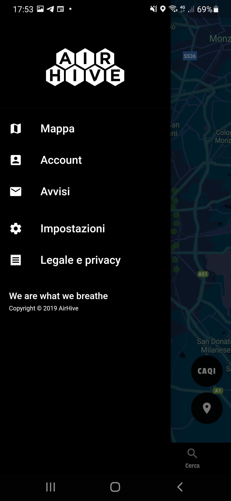

# Mobile application

A Flutter mobile application for the project.

## Features:
### 1. See at first glance the air quality around you and choose what index you want to see

### 2. Get more details

### 3. Search for places

### 4. Immediate menu

